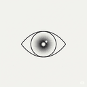
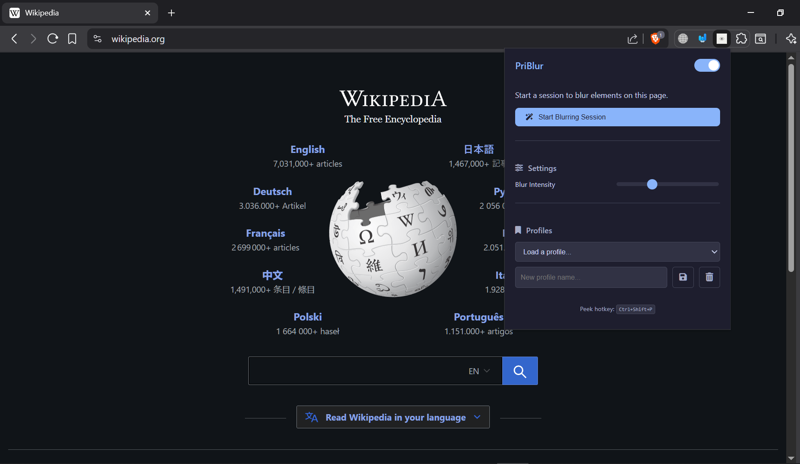
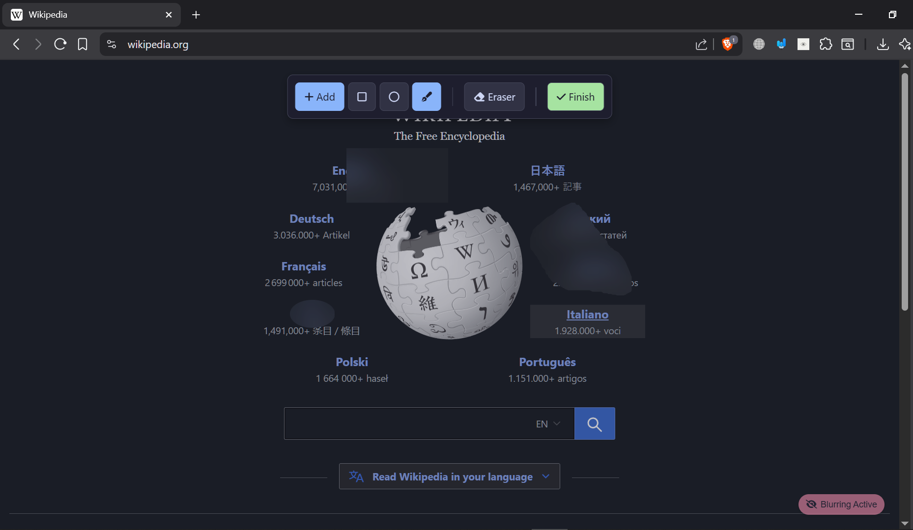

  
  <h1>PriBlur</h1>
  
<strong>Protect your sensitive information during screen sharing by blurring any part of your screen. Simple, powerful, and secure.</strong>

---

## 👋 Introduction

Welcome to **PriBlur**!

This browser extension gives you the power to hide sensitive information on any webpage with a single click. Whether you're in a business presentation, a live demo, or an online class, you can confidently share your screen knowing that your private data, personal messages, or confidential work details are safely blurred out.

Our goal is to provide a tool that is both easy to use and completely secure, running entirely on your computer without ever touching your data.

## ✨ Key Features

-   🎨 **Multiple Blur Shapes:** Choose between Rectangle, Circle, or a freeform Custom Shape tool.
-   🖱️ **Interactive Editing:** All blur regions are draggable and can be removed instantly with the Eraser tool.
-   📄 **Sticks to Content:** Blurs scroll with the page, ensuring they always cover the intended element.
-   💾 **Save Your Layouts:** Create "Profiles" to instantly load specific blur setups for different tasks (e.g., "Work Meeting," "Personal Project").
-   👁️ **Toggle Mode:** Temporarily disable all blurs with a hotkey (**`Alt+P`**) to quickly see the content underneath.
-   🔒 **100% Private:** The extension is fully self-contained. Your data, Browse activity, or blur patterns are never collected or transmitted anywhere.

## 🚀 How to Use

### 1. Starting an Editing Session

1.  Click the **PriBlur icon** in your Chrome toolbar.
2.  Click the big blue **"Start Blurring Session"** button.
3.  The editing toolbar will appear at the top of your screen, ready for action!

### 2. The Editing Toolbar

This is your main control center for creating and managing blurs.

| Icon             | Tool             | Description                                                                |
| :--------------- | :--------------- | :------------------------------------------------------------------------- |
| ➕ **Add**       | Activate Drawing | The main button to enter drawing mode. It defaults to the Rectangle shape. |
| ⬜ **Rectangle** | Shape Tool       | Click and drag on the page to create a rectangular blur.                   |
| ⚪ **Circle**    | Shape Tool       | Click and drag on the page to create a circular or elliptical blur.        |
| ✍️ **Draw**      | Custom Shape     | Draw a freeform shape to blur a specific, irregular area.                  |
| 🧽 **Eraser**    | Eraser Tool      | Select this, then click on any blur region to delete it.                   |
| ✔️ **Finish**    | Finish Editing   | Hides the toolbar but keeps your blurs active.                             |

### 3. Managing Your Blurs

-   **To Draw:** Make sure a shape tool (like Rectangle) is active. Click and drag on the page to create your blur.
-   **To Move:** Simply click and drag any existing blur region to a new position.
-   **To Add More:** If you've finished editing, click the extension icon and select **"Add More"** to bring the toolbar back.

### 4. Using Profiles to Save Time

Perfect for recurring meetings or presentations!

1.  Arrange your blur regions exactly how you want them.
2.  Open the popup by clicking the extension icon.
3.  In the **"Profiles"** section, type a name (e.g., "Daily Stand-up") into the input box.
4.  Click the **Save icon** (💾).
5.  To load this layout in the future, just select it from the dropdown menu!

## ❓ Frequently Asked Questions (FAQ)

> **Q: Will this work with Zoom, Google Meet, or Microsoft Teams?**
>
> **A:** Yes! It works on any website you are sharing via your Chrome browser tab. The blur is applied directly to the webpage, so anyone viewing your screen share will see the blurred areas.

> **Q: Do the blurs stay in one place or move when I scroll?**
>
> **A:** The blurs are designed to "stick" to the content on the page. If you blur a paragraph at the top of a long article, that blur will scroll up with the paragraph, which is the intended behavior.

> **Q: Is this extension secure? Is my data safe?**
>
> **A:** Your security is our top priority. The extension is 100% client-side, meaning all operations happen directly on your computer. We do not—and cannot—collect, store, or transmit any of your data, Browse history, or personal information.

## 💬 Feedback & Contributions

This is an open-source project. If you find a bug, have a feature request, or would like to contribute, please feel free to check out the `CONTRIBUTING.md` file and open an issue or pull request on our GitHub repository!

## 📜 License

This project is licensed under the MIT License - see the [LICENSE](LICENSE) file for details.

---

  <small>Copyright © 2025 Tosmim. All Rights Reserved.</small>

